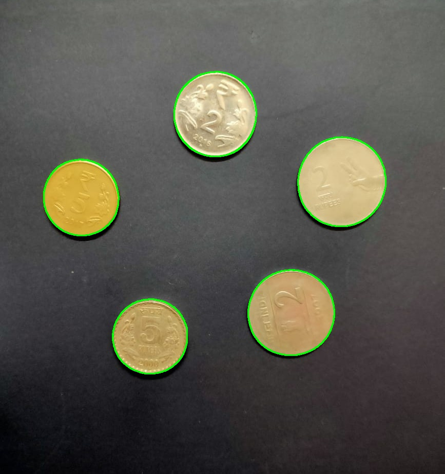
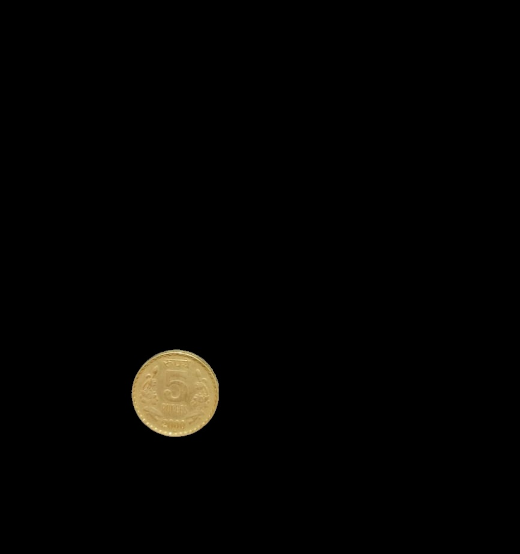

# 🪙 Coin Detection, Segmentation, and Counting

## 📌 Introduction

This project detects, segments, and counts coins in an image using **OpenCV**, **NumPy**, and **Matplotlib**. Implemented in a Jupyter Notebook (`coin_detection.ipynb`), it includes two models: a basic approach for general object detection and an advanced approach for circular objects like coins. The input image is "C4.jpg", stored in this folder, and the project generates visualizations and segmented outputs.

---

## 💁‍♂️ Folder Structure

```
Coin_Detection/
├── coin_detection.ipynb  # Jupyter Notebook with both models
├── C4.jpg  # Input image
├── highlighted_objects.jpg  # Model 1: Coins with contours
├── identified_shapes.jpg  # Model 2: Filtered coin contours
├── segmentation_output.jpg  # Model 2: Colorized segmentation mask
├── model1_coin_1.jpg  # Model 1: Extracted coin 1
├── model1_coin_2.jpg  # Model 1: Extracted coin 2, etc.
├── model2_coin_1.jpg  # Model 2: Extracted coin 1
├── model2_coin_2.jpg  # Model 2: Extracted coin 2, etc.
├── README.md
```

---

## 🚀 Getting Started

### 🔹 1. Navigate to the Folder

Assuming the parent repository `VR_Assignment1_NavalKishoreSinghBisht_MT2024099` is cloned:

```bash
cd VR_Assignment1_NavalKishoreSinghBisht_MT2024099/Coin_Detection
```

### 🔹 2. Install Dependencies

Ensure Python and Jupyter are installed, then run:

```bash
pip install opencv-python numpy matplotlib jupyter
```

### 🔹 3. Prepare Input

The input image "C51.jpg" is already in this folder.

### 🔹 4. Open the Jupyter Notebook

```bash
jupyter notebook coin_detection.ipynb
```

Run the cells corresponding to each model to process the image.

### 🔹 5. View the Results

Each model produces:

- **Model 1**: Contoured image, individual objects, coin count.
- **Model 2**: Contoured image, segmentation mask, cropped objects, coin count.
- Visualizations in Matplotlib and saved files in this folder.

---

## 🧪 Methods and Techniques

### 🎯 Model 1: Basic Edge Detection and Contour Finding

- **Steps**:
  1. Convert to grayscale.
  2. Apply **Gaussian Blur** (13x13, sigma=3) for noise reduction.
  3. Use **Canny Edge Detection** (50, 150) to find edges.
  4. Detect contours with `cv2.findContours`.
  5. Draw green contours and isolate objects with masks.
- **Outputs**:
  - "highlighted_objects.jpg": Image with contours.
  - "model1*coin*{index+1}.jpg": Individual objects.
  - Printed total object count.

### 🎯 Model 2: Advanced Circular Object Detection

- **Steps**:
  1. Convert to grayscale.
  2. Apply **Gaussian Blur** (11x11, sigma=2).
  3. Use **Canny Edge Detection** (30, 150).
  4. Apply **morphological closing** (5x5 kernel).
  5. Filter contours by area (1000–50,000) and roundness (>0.7).
  6. Draw contours, create a colorized mask, and crop objects.
- **Outputs**:
  - "identified_shapes.jpg": Filtered contours.
  - "segmentation_output.jpg": Colorized mask.
  - "model2*coin*{index+1}.jpg": Cropped objects.
  - Printed total object count.

---

## ⚡ Optimizations

- **Noise Reduction**: Gaussian Blur in both models.
- **Shape Filtering**: Model 2 uses size and roundness to target coins.

---

## 📊 Results & Observations

| Feature          | Model 1 Outcome                          | Model 2 Outcome                            |
| ---------------- | ---------------------------------------- | ------------------------------------------ |
| **Detection**    | Detects all contours, may include noise. | Filters for circular coins, reduces noise. |
| **Segmentation** | Basic masks, no shape filtering.         | Colorized mask, precise cropping.          |
| **Coin Count**   | May overcount due to no filtering.       | Accurate for circular objects.             |

### 📌 Model Comparison Summary

- **Model 1**: Broad detection, useful for general objects.
- **Model 2**: Specialized for coins, improves accuracy.

---

## 🔍 Challenges & Solutions

### ⚠️ Issues Faced

- **Noise**: False positives in edge detection.
- **Overlapping Objects**: May merge in Model 1.

### ✅ Solutions Implemented

- **Blur**: Reduces noise in both models.
- **Filtering**: Model 2 uses shape constraints to refine results.

---

## 📸 Sample Outputs

### 📌 Input Image


### 📌 Model 1: Contours and Extracted Coins




### 📌 Model 2: Contours, Mask, and Extracted Coins


---

## 🔑 Key Learnings & Takeaways

- **Gaussian Blur**: Enhances edge detection.
- **Morphological Closing**: Refines edges (Model 2).
- **Contour Filtering**: Targets specific shapes (Model 2).
- **Visualization**: Aids in understanding results.

This project demonstrates basic and advanced techniques for coin detection and segmentation! 🚀
