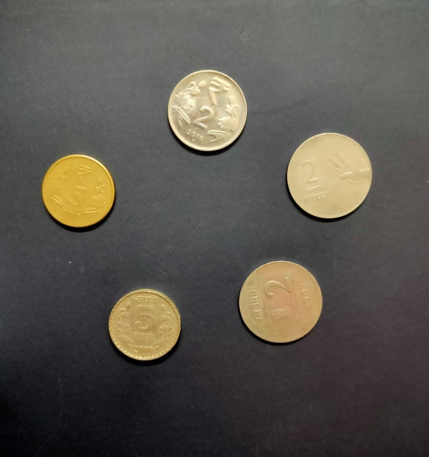
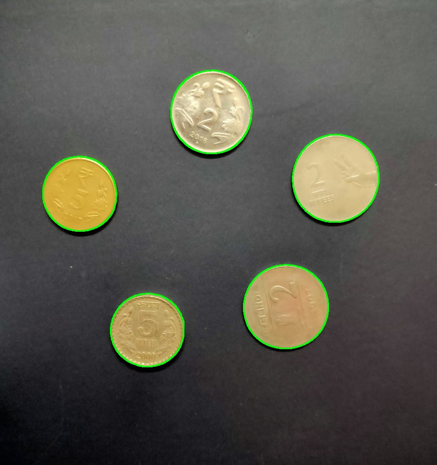
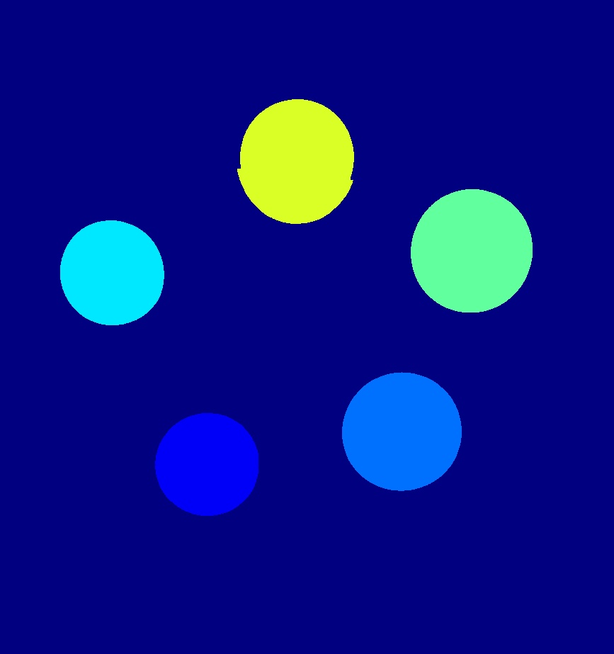
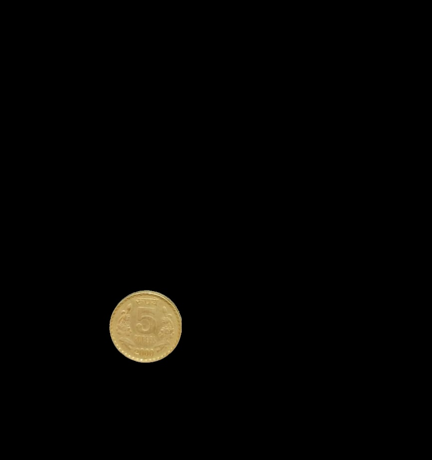
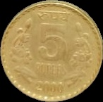

# VR_Assignment1_NavalKishoreSinghBisht_MT2024099

## 📌 Introduction

This repository contains two Jupyter Notebook files for computer vision tasks:
1. **Coin Detection and Segmentation** (`Coin_Detection/coin_detection.ipynb`): Detects, segments, and counts coins in an image using OpenCV techniques.
2. **Panorama Creation** (`Panorama_Stitching/panorama_stitching.ipynb`): Stitches multiple overlapping images into a panoramic view using feature-based methods and OpenCV’s Stitcher.

Both notebooks are implemented in Python, leveraging **OpenCV**, **NumPy**, and **Matplotlib**, and are submitted as part of the assignment for Naval Kishore Singh Bisht (MT2024099). Visual outputs are saved and displayed within their respective subfolders.

---

## 💁‍♂️ Repository Structure

```
VR_Assignment1_NavalKishoreSinghBisht_MT2024099/
│── Coin_Detection/
│   ├── coin_detection.ipynb  # Notebook for coin detection and segmentation
│   ├── C51.jpg  # Input image
│   ├── highlighted_objects.jpg  # Model 1: Coins with contours
│   ├── identified_shapes.jpg  # Model 2: Filtered coin contours
│   ├── segmentation_output.jpg  # Model 2: Colorized segmentation mask
│   ├── model1_coin_1.jpg  # Model 1: Extracted coin 1
│   ├── model1_coin_2.jpg  # Model 1: Extracted coin 2, etc.
│   ├── model2_coin_1.jpg  # Model 2: Extracted coin 1
│   ├── model2_coin_2.jpg  # Model 2: Extracted coin 2, etc.
│── Panorama_Stitching/
│   ├── panorama_stitching.ipynb  # Notebook for panorama creation
│   ├── P1.jpg  # First input image
│   ├── P2.jpg  # Second input image
│   ├── P3.jpg  # Third input image
│   ├── model1_stitched_P12.jpg  # Model 1: P1 + P2 intermediate
│   ├── model1_final_panorama.jpg  # Model 1: Final panorama
│   ├── model1_P1_keypoints.jpg  # Model 1: P1 keypoints
│   ├── model1_P2_keypoints.jpg  # Model 1: P2 keypoints
│   ├── model1_P12_keypoints.jpg  # Model 1: P12 keypoints
│   ├── model1_P3_keypoints.jpg  # Model 1: P3 keypoints
│   ├── model2_P1_to_P2_matches.jpg  # Model 2: P1-P2 matches
│   ├── model2_P1_to_P3_matches.jpg  # Model 2: P1-P3 matches
│   ├── model2_warped_P2.jpg  # Model 2: Warped P2
│   ├── model2_warped_P3.jpg  # Model 2: Warped P3
│   ├── model2_final_panorama.jpg  # Model 2: Final panorama
│   ├── model3_final_panorama.jpg  # Model 3: Final panorama
│── README.md
```

---

## 🚀 Getting Started

### 🔹 1. Clone the Repository
```bash
git clone https://github.com/Naval-Bisht/VR_Assignment1_NavalKishoreSinghBisht_MT2024099.git 
cd VR_Assignment1_NavalKishoreSinghBisht_MT2024099
```

### 🔹 2. Install Dependencies
Ensure Python 3.x and Jupyter Notebook are installed, then install the required libraries:
```bash
pip install opencv-python numpy matplotlib jupyter
```

### 🔹 3. Prepare Input Images
The input images are already included in the subfolders and also in main folder.
- `C51.jpg`
- `P1.jpg`, `P2.jpg`, `P3.jpg`

### 🔹 4. Run the Notebooks
Open and run each notebook from its subfolder:
- **Coin Detection**:
  ```bash
  cd Coin_Detection
  jupyter notebook coin_detection.ipynb
  ```
  - Execute all cells to process "C51.jpg".
  - Their are multiple images for coins where u can check the coin_detection.
- **Panorama Stitching**:
  ```bash
  cd Panorama_Stitching
  jupyter notebook panorama_stitching.ipynb
  ```
  - Execute all cells to process "P1.jpg", "P2.jpg", and "P3.jpg".

### 🔹 5. View Results
- Outputs are saved in their respective subfolders (`Coin_Detection/` and `Panorama_Stitching/`).
- Visualizations (e.g., plots) are displayed in the notebook and can be closed manually.

---

## 🛠️ Methods and Techniques

### 🔹 Coin Detection and Segmentation (`coin_detection.ipynb`)
#### Model 1: Basic Edge Detection
- **Input**: "C51.jpg"
- **Steps**:
  1. Convert to grayscale.
  2. Apply Gaussian Blur (13x13, sigma=3) for noise reduction.
  3. Use Canny Edge Detection (50, 150) to find edges.
  4. Detect contours with `cv2.findContours`.
  5. Draw green contours and isolate objects with masks.
- **Outputs**: "highlighted_objects.jpg", "model1_coin_{index+1}.jpg", coin count printed.

#### Model 2: Advanced Circular Detection
- **Input**: "C51.jpg"
- **Steps**:
  1. Convert to grayscale.
  2. Apply Gaussian Blur (11x11, sigma=2).
  3. Use Canny Edge Detection (30, 150).
  4. Apply morphological closing (5x5 kernel).
  5. Filter contours by area (1000–50,000) and roundness (>0.7).
  6. Draw contours, create a colorized mask, and crop objects.
- **Outputs**: "identified_shapes.jpg", "segmentation_output.jpg", "model2_coin_{index+1}.jpg", coin count printed.


### 🔹 Panorama Creation (`panorama_stitching.ipynb`)
#### Model 1: Pairwise Stitching with SIFT
- **Input**: "P1.jpg", "P2.jpg", "P3.jpg"
- **Steps**:
  1. Detect SIFT keypoints and match with BFMatcher (KNN, 0.75 ratio).
  2. Compute homography (RANSAC, 5.0).
  3. Warp and stitch P1+P2, then result+P3 (2x width canvas).
- **Outputs**: "model1_stitched_P12.jpg", "model1_final_panorama.jpg", keypoint images.

#### Model 2: All-at-Once Stitching with SIFT
- **Input**: "P1.jpg", "P2.jpg", "P3.jpg"
- **Steps**:
  1. Detect SIFT keypoints and match with BFMatcher (KNN, 0.75 ratio).
  2. Compute homography relative to P1.
  3. Warp all images into a 3x width canvas and blend.
- **Outputs**: "model2_final_panorama.jpg", match and warped images.

#### Model 3: OpenCV Stitcher
- **Input**: "P1.jpg", "P2.jpg", "P3.jpg"
- **Steps**:
  1. Use `cv2.Stitcher` for automated stitching (internal feature detection and blending).
- **Outputs**: "model3_final_panorama.jpg".

---

## 📊 Results and Observations

### Coin Detection
| Feature               | Model 1 Outcome                          | Model 2 Outcome                          |
|-----------------------|------------------------------------------|------------------------------------------|
| **Detection**         | Detects all contours, may include noise. | Filters for circular coins, reduces noise.|
| **Segmentation**      | Basic masks, no shape filtering.         | Colorized mask, precise cropping.        |
| **Coin Count**        | May overcount due to no filtering.       | Accurate for circular objects.           |

### Panorama Creation
| Feature               | Model 1 Outcome                          | Model 2 Outcome                          | Model 3 Outcome                          |
|-----------------------|------------------------------------------|------------------------------------------|------------------------------------------|
| **Stitching**         | Pairwise, may accumulate errors.         | All-at-once, aligns to P1.               | Automated, seamless.                     |
| **Quality**           | Simple overlay, potential seams.         | Overlay blending, potential seams.       | Advanced blending, high quality.         |

**Observations**:
- Coin Model 2 enhances accuracy for circular objects compared to Model 1’s broader detection.
- Panorama Model 3 delivers superior quality with minimal effort, while Models 1 and 2 provide control and debugging insights.

---

## 📸 Visual Outputs

### Coin Detection (in `Coin_Detection/`)
- **Input**: 
- **Model 1 Output**: 
- **Model 2 Output**: 
- **Segmentation Mask**: 
- **Extracted Coins**:  


### Panorama Creation (in `Panorama_Stitching/`)
- **Input Images**:   
- **Model 1 Outputs**:  
- **Model 2 Outputs**:  
- **Model 3 Output**: 

---

Submitted by: Naval Kishore Singh Bisht (MT2024099)
